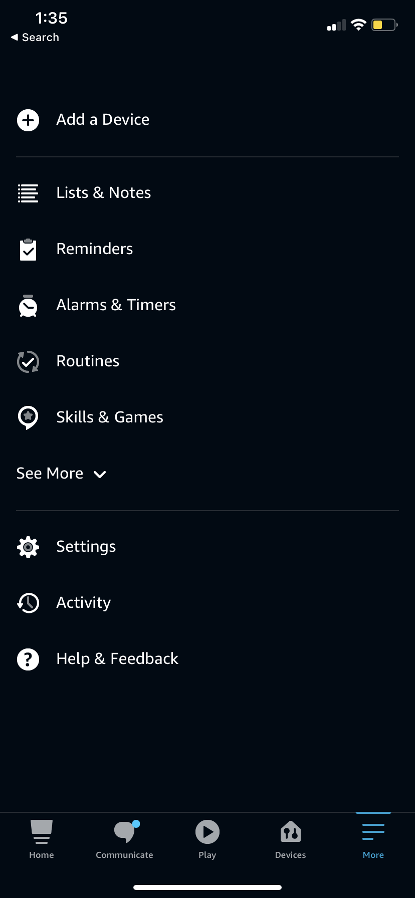
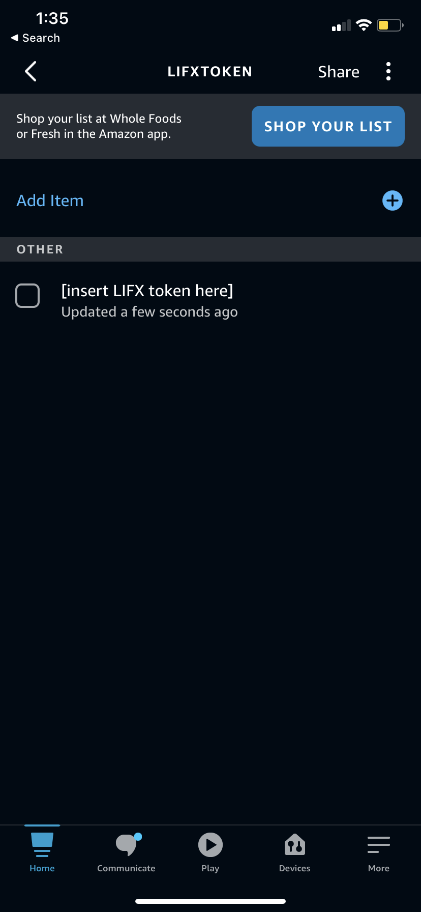
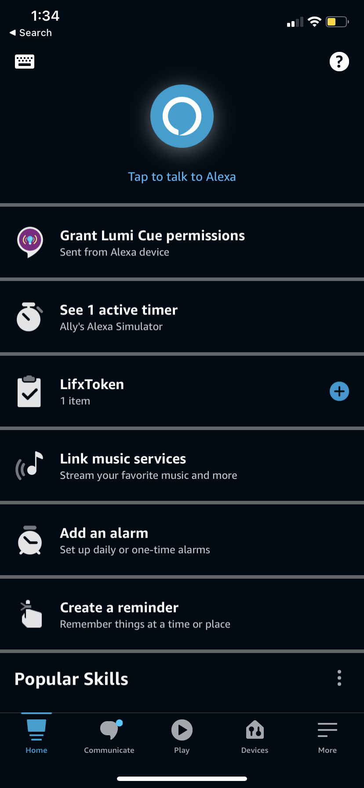
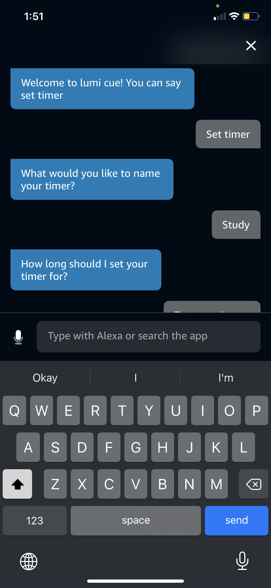
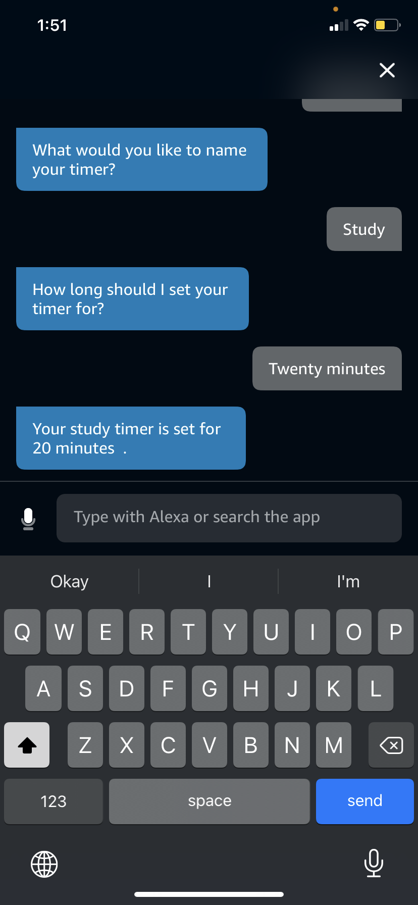
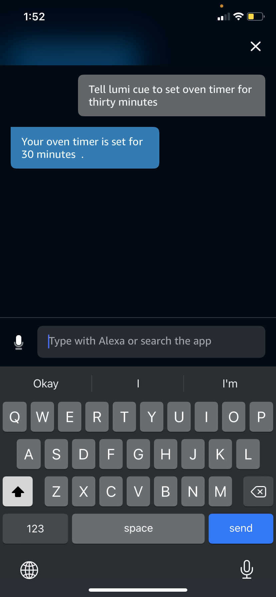
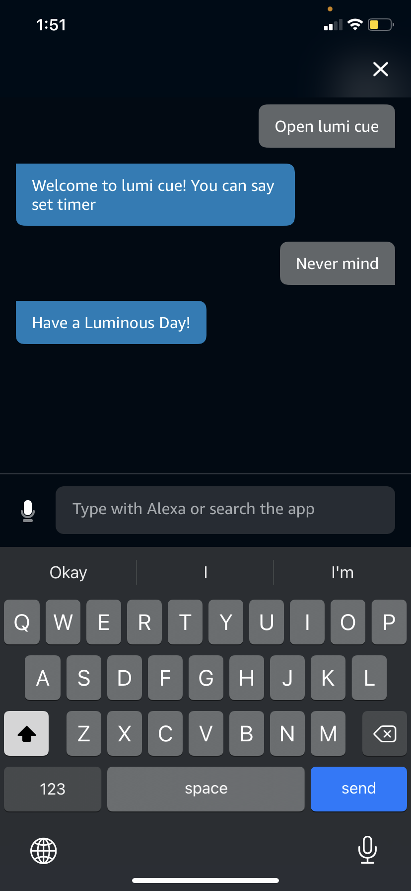

# Lumi Cue
- [Lumi Cue](#lumi-cue)
  - [Usage](#usage)
  - [Using Lumi Cue for the first time](#using-lumi-cue-for-the-first-time)
    - [Creating a Lifx Token](#creating-a-lifx-token)
    - [Granting permissions](#granting-permissions)
    - [Setting your first timer](#setting-your-first-timer)
  - [Interacting with Lumi Cue](#interacting-with-lumi-cue)
  - [Known issues](#known-issues)
  - [Authors](#authors)
    - [**Aleia DeVore**](#aleia-devore)
    - [**Carlos Esquivel**](#carlos-esquivel)
  - [Acknowledgements](#acknowledgements)

Lumi Cue is an Alexa skill that combines visual and auditory cues for timers. Ask Alexa to tell Lumi Cue to set a timer. While it runs, your Lifx lights will create a soothing ambiance. At the end of your timer, the lights will revert back to your original settings.

[Learn More](https://aleiadevore.github.io/lumi_cue/index.html)

## Usage
- To use our application you will need an [Alexa Developer Console](https://developer.amazon.com/alexa/console/ask) account to be able to use the skill. 
- Once you have an account, you will want to go to the [Lumi Cue Github Repository](https://github.com/aleiadevore/lumi_cue/tree/main) and fork the repo so that you can import the task from github.
- After forking the repository, you can go back to the [Amazon Developer Console](https://developer.amazon.com/alexa/console/ask). From there you want to click on **create skill** to make an Alexa skill that you can import to.
- You will want to give your skill a name and choose the **custom model** and **node.js** options. 
- Once you click create skill in the top right corner you will be taken to a page which has you select template for your skill. On this page you will want to select **import skill** in the top right corner of the page.
- Here you can paste the link from the forked Repository that you made.
## Using Lumi Cue for the first time
Before using Lumi Cue for the first time, you will need to set up your personal Lifx token.

### Creating a Lifx Token
If you have a Lifx account already set up, follow [this link](https://cloud.lifx.com/settings) to the Lifx Cloud to generate a unique user token. Lumi Cue will use this token in order to toggle your personal Lifx lights.

Once you have created your personal Lifx token, open the Alexa app on your phone, and do the following:
1. Navigate to the icon on the bottom right of the screen labeled "More."
2. Select "Lists and Notes."
3. Create a new list named **EXACTLY** "LifxToken"
4. Paste your personal Lifx token as the only item in the list.

   

| ⚠️ NOTE: Lumi Cue will use this list each time you call the skill in order to access your personal token. **Do not delete this list after your first use.** |
| --- |

### Granting permissions
To open Lumi Cue for the first time, tell Alexa "Open Lumi Cue."
She will respond by saying that Lumi Cue needs permission to access your timers and lists. To grant Lumi Cue permissions, open your Alexa app on your phone and click the card to grant permissions to Lumi Cue.

### Setting your first timer
Once you have put your Lifx token in the correct list and granted Lumi Cue permissions, you're ready to create your first timer! After opening Lumi Cue, you can say "Set timer," and Alexa will prompt you for the name and length of the timer.
>> "Set timer."

>> "Set oven timer for thirty minutes."

  

After your first time opening Lumi Cue, you can call comands at the same time that you invoke the skill. For example, you may say,
>>"Hey Alexa, tell Lumi Cue to set a laundry timer for twenty minutes."

At any point, you can exit Lumi Cue by saying an exit command.

>> "Exit."

>> "Never mind."

## Interacting with Lumi Cue

## Known issues
While we strived to create the best skill possible in the time given, there are some issues that we will update as we are able. These include:
- Handling Lifx white lights
- Saving tokens long-term

## Authors
### **Aleia DeVore**
Aleia DeVore came to Tulsa from North Carolina in 2016 as an AmeriCorps VISTA. After four years working with the Tulsa Regional STEM Alliance to encourage students to explore STEM fields, Aleia decided to pursue one herself.

As a software engineering student, Aleia enjoys finding creative ways to solve problems and exploring ways to make tech inclusive and accessible.

* 📖 [Medium](https://aleiadevore.medium.com/a-meet-lumi-cue-te-10e32ab24b2)
* :bird:[Twitter](https://twitter.com/aleiadevore)

* :robot: [GitHub](https://github.com/aleiadevore)

* :briefcase: [LinkedIn](https://www.linkedin.com/in/aleiamcnaney/)

### **Carlos Esquivel**
Carlos Esquivel is originally from Tulsa. After taking a gap year and working in sales, he decided to make a switch into the technology industry to obtain skills in software engineering. As the pandemic hit, Holberton school provided an opportunity to learn and grow in a remote working environment.

As a software engineering student, Carlos enjoys the creative aspects of problem solving such as how collaboration can foster the transfer of knowledge.

* 📖 [Medium](https://1831-9922.medium.com/)
* :bird:[Twitter](https://twitter.com/esquivelcarlo12)

* :robot: [GitHub](https://github.com/CSant04y)

* :briefcase: [LinkedIn](https://www.linkedin.com/in/carlos-esquivel-515768186/)
## Acknowledgements
* [Dabble Lab Alexa Timer Skill](https://github.com/dabblelab/19-alexa-timers-example-skill)

* [Sample Random Fact Skill](https://www.c-sharpcorner.com/article/creating-food-fact-skill-using-fact-skill-template/)
